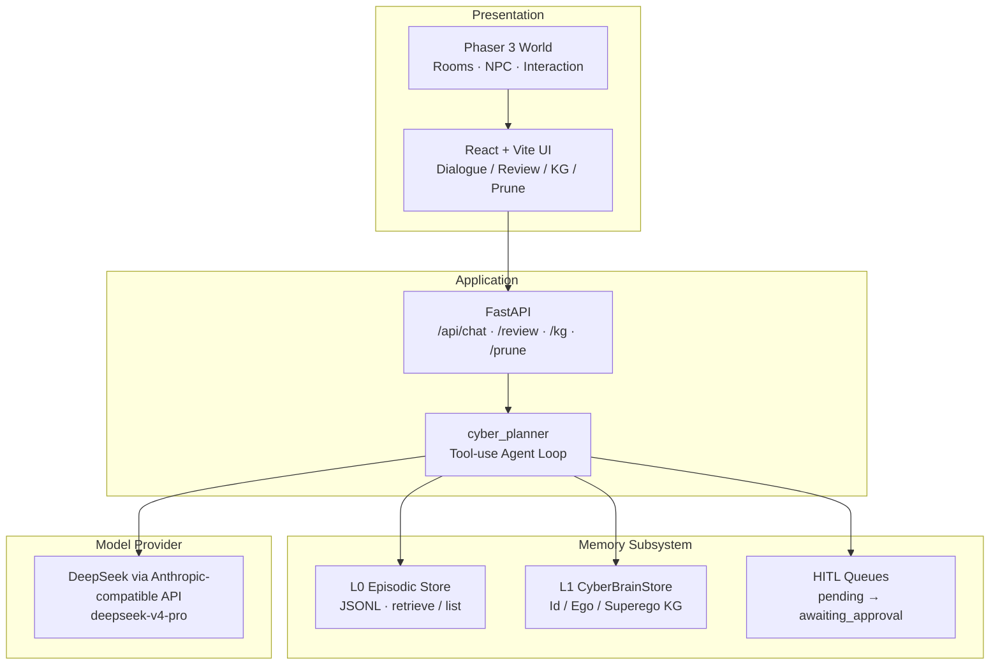
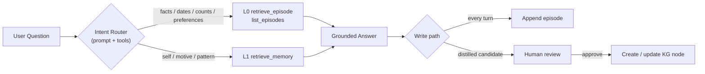
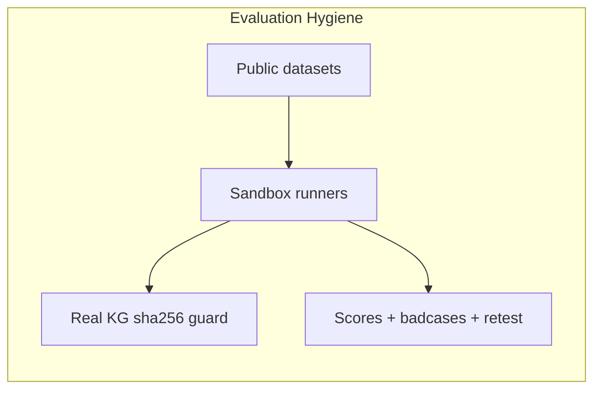

# Cyber Minghan（赛博明翰）

> **长期记忆个性化对话 Agent**：L0 原文情景记忆 + L1 动力学知识图谱 + HITL 写入纪律  
> Personal project · Agent memory · Eval-driven iteration

[](.)
[](.)
[](.)
[](LICENSE)

---

## 1. 项目是什么

赛博明翰不是「又一个 ChatBot UI」，而是一个把 **长期记忆** 当成一等公民的个人 Agent 原型：

| 问题 | 本项目的答案 |
|------|----------------|
| 只蒸馏人格会丢事实 | **L0 Episodic**：保留原文轮次，可检索 / 可列举 |
| 只做 RAG 没有「我是谁」 | **L1 Dynamics KG**：Id / Ego / Superego 三层动力学节点 |
| 自动写入会污染人设 | **HITL**：L1 写入需审批；L0 可自动 append，但不替代人审 |
| 分数无法对外讲 | **公开集评测沙箱** + 真库隔离（sha256） |

面向展示：Web 前端（像素空间 + 对话/图谱/审核面板）+ FastAPI + Tool Use 记忆引擎。

更完整的产品说明见 → [`docs/PRD.md`](docs/PRD.md)

---

## 2. 系统总览



### 双层记忆路由



---

## 3. 核心能力

1. **Tool-use 对话环**：模型按需调用记忆工具，禁止无检索编造个人事实。  
2. **L0 Episodic**：`append` / `search` / `list_episodes`（分页全扫，服务计数与多会话聚合）。  
3. **L1 Dynamics KG**：三层节点 CRUD + 检索；重要性与归档（prune）机制。  
4. **HITL**：观察蓄水池 → 批处理候选 → 人工审批写库。  
5. **专项模式**：健康教练等（协议驱动，可扩展房间）。  
6. **评测沙箱**：公开集对齐；评测不写真图谱。

---

## 4. 仓库结构

```text
cyber_minghan/
├── README.md                 # 本文件（展示入口）
├── docs/
│   ├── PRD.md                # 产品需求文档
│   ├── TECH_SPEC.md          # 前端/交互技术规范
│   └── evals/                # 评测方案 / 迁入 handoff
├── evals/                    # 公开集 · 沙箱 · 产品契约（统一入口）
├── api/                      # FastAPI 入口与路由
├── frontend/                 # React + Phaser 客户端
├── memory/                   # L0 episodic_store / tools / policy
├── pipelines/                # 蒸馏、HITL、批处理
├── cyber_planner.py          # Agent 核心（工具环 + KG）
├── health_coach.py           # 健康专项
├── yuanbao_cyber_minghan_kg.json        # L1 图谱（公开前请脱敏）
└── yuanbao_cyber_minghan_kg_EMPTY.json  # 空图谱模板
```

评测怎么跑、目录说明见 → [`evals/README.md`](evals/README.md)

---

## 5. 快速开始

### 5.1 环境

- Python 3.9+
- Node.js 18+
- DeepSeek（或任意 Anthropic-compatible）API Key

### 5.2 配置

```bash
cp .env.example .env   # 若尚无示例文件，按下列变量自建
```

```env
ANTHROPIC_API_KEY=your_key
ANTHROPIC_BASE_URL=https://api.deepseek.com/anthropic
MODEL=deepseek-v4-pro
# 可选
# KG_PATH=./yuanbao_cyber_minghan_kg.json
# EPI_PATH=./memory/episodic/cyber_minghan_live.jsonl
```

> **安全**：切勿提交 `.env` / `.env.bak*` / 含真实 Key 的文件。

### 5.3 启动后端

```bash
pip install -r requirements.txt
uvicorn api.main:app --reload --port 8000
```

### 5.4 启动前端

```bash
cd frontend
npm install
npm run dev
```

浏览器打开 Vite 提示的本地地址（默认常为 `http://localhost:5173`；若 CORS 端口不一致，请对齐 `api/main.py` 白名单或改前端代理）。

### 5.5 CLI（可选）

```bash
python3 cyber_planner.py
```

---

## 6. 评测结果（对外口径）

评测产物在 [`evals/`](evals/)（沙箱 `results/`）；方法论文档在 [`docs/evals/`](docs/evals/)。完整大数据集请从官方源获取。

| Benchmark | Setting | Result | Notes |
|-----------|---------|--------|-------|
| MemoryBank-CN | 15 users / 100 Q · L0 | **90/100** | 中文陪伴探测 |
| LongMemEval | **oracle** full 500 | **0.808** | 证据会话设定；非 S |
| LongMemEval | v1 retest（103 bad + 50 reg） | fix **57%** · reg **0.94** | `question_date` + `list_episodes` |
| LongMemEval | **S** stratified sample n=40 | **0.875** | 非全量 500；行业主设定抽样 |
| MINI 契约 | Abstain / Faithfulness / Update | 10/10 · 8/10 · 4/5 | 产品能力门禁 |

**必须声明的限制**

- Oracle ≠ LongMemEval-S/M；不可与厂商 S 全量榜直接横比。  
- Judge 为 DeepSeek LLM-as-judge，非官方 GPT-4o 脚本。  
- 未宣称 LongMemEval-S 全量 SOTA；未跑 M。



---

## 7. 演示路径（面试 / GitHub）

建议 3 分钟 walkthrough：

1. 进入像素空间，与赛博明翰对话。  
2. 询问需记忆的事实或偏好 → 观察工具调用（L0/L1）。  
3. 打开 KG / Review 面板，说明 HITL 与「自动写库」的边界。  
4. 用 README 表格口述评测：oracle 全量、S 抽样、MemoryBank。

（可在此嵌入 Demo GIF / 视频链接）

---

## 8. 文档地图

| 文档 | 用途 |
|------|------|
| [`docs/PRD.md`](docs/PRD.md) | 产品需求、范围、成功指标 |
| [`docs/TECH_SPEC.md`](docs/TECH_SPEC.md) | 前端与交互技术规范 |
| [`docs/SYSTEM_DESIGN_V2.md`](docs/SYSTEM_DESIGN_V2.md) | 系统设计 |
| [`docs/USER_GUIDE_CRUD.md`](docs/USER_GUIDE_CRUD.md) | KG 操作指南 |
| [`memory/`](memory/) | L0 实现与评测策略文案 |
| [`evals/README.md`](evals/README.md) | 公开集 / 沙箱 / 产品契约入口 |
| [`docs/evals/`](docs/evals/) | 评测方案与迁入 handoff |

---

## 9. 安全与合规（公开仓必读）

- [ ] 轮换并作废曾出现在聊天/截图中的 API Key  
- [ ] 公开前脱敏 KG（真实人名、私密节点）或仅发布 EMPTY + 示例  
- [ ] 不要上传第三方游戏完整美术资源包；仅保留你有权分发的资产  
- [ ] `decision_logs/`、本地 episodic 运行时数据默认不入库  

---

## 10. Roadmap（公开版）

| Status | Item |
|--------|------|
| Done | L0+L1 双层、Tool Use、HITL、Web demo、公开集评测闭环 |
| Next | README Demo 录像、公开脱敏图谱、一键 compose |
| Later | LongMemEval-S 更大样本、向量检索、多用户隔离 |

---

## 11. License

代码默认以 MIT 意向开源（若仓内尚无 `LICENSE` 文件，发布前请补齐）。  
第三方数据集与美术素材遵循其各自许可，不随本声明自动授权。

---

**Author:** Minghan Gao（高明翰）· 2027 秋招作品集项目  
**Remote:** `github.com/Andy021110/cyber_minghan`
