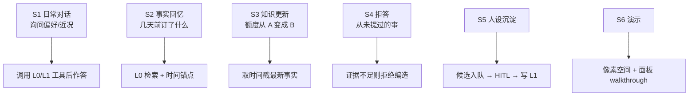
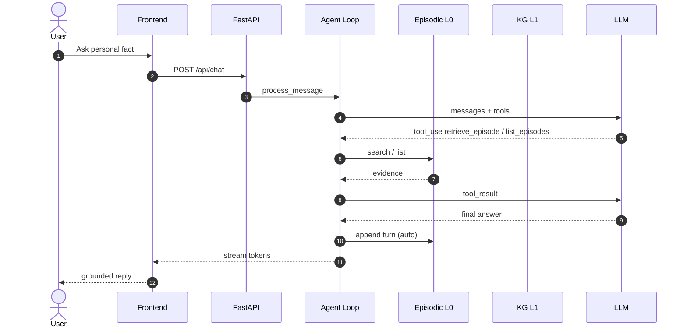
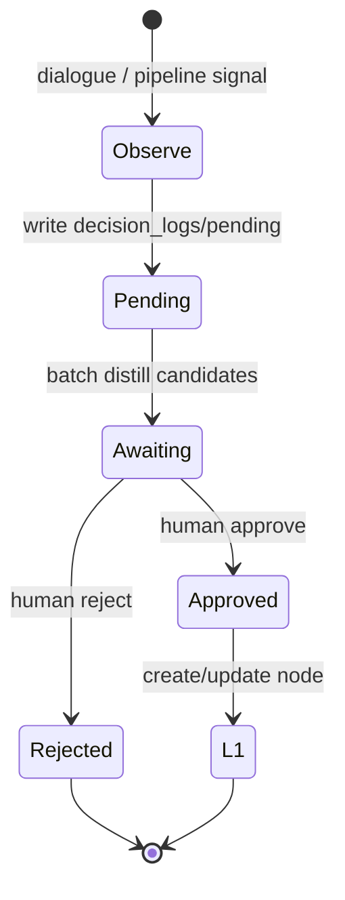
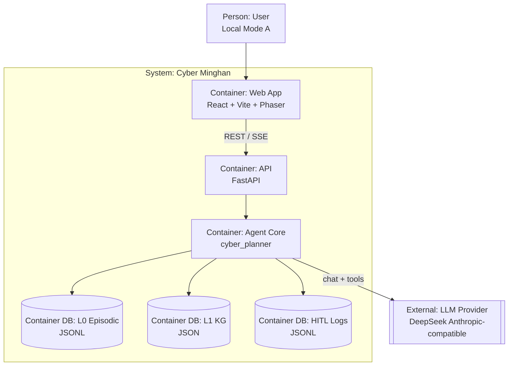
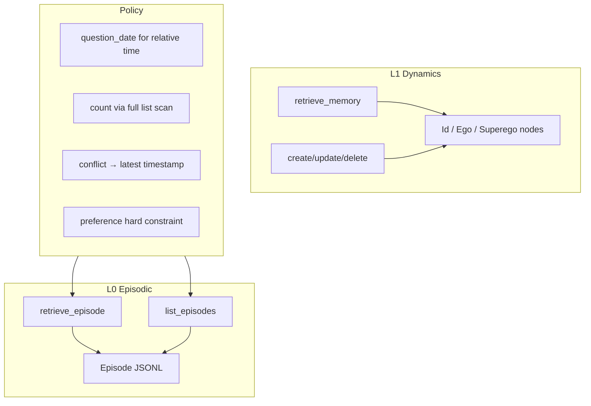
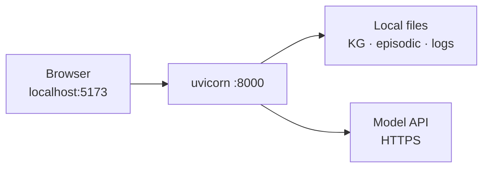
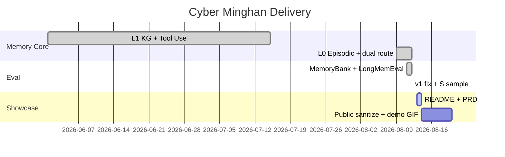

# 产品需求文档（PRD）｜赛博明翰 Cyber Minghan

| 字段 | 内容 |
|------|------|
| 文档状态 | Active / Showcase-ready |
| 版本 | v1.1 |
| 日期 | 2026-08-13 |
| 产品名 | 赛博明翰（Cyber Minghan） |
| 文档受众 | 面试官、开源协作者、未来的自己 |
| 相关文档 | [README](../README.md) · [TECH_SPEC](./TECH_SPEC.md) · [SYSTEM_DESIGN_V2](./SYSTEM_DESIGN_V2.md) |

---

## 1. 背景与问题

### 1.1 背景

个人长期对话助手正在从「单轮聪明」转向「跨会话记得住、敢更新、会拒答」。业界用 LongMemEval / MemoryBank 等基准衡量长期交互记忆；产品侧还需要人格一致性与可控写入。

### 1.2 问题陈述

| ID | 问题 | 现状痛点 |
|----|------|----------|
| P1 | 事实易丢 | 仅用人格/动力学蒸馏时，电影名、日期、数量等事实保真下降 |
| P2 | 人格易漂 | 纯 RAG 堆原文，缺少稳定的「我是谁」结构 |
| P3 | 写入失控 | 自动把对话写进人设库，会造成噪声与隐私风险 |
| P4 | 无法证明 | 没有公开集与隔离评测时，记忆能力只能靠感觉 |

### 1.3 产品一句话

**赛博明翰是一个带双层记忆与人工审核纪律的个性化对话 Agent：L0 记住说过的事实，L1 沉淀可解释的认知模式，前端提供可演示的交互空间。**

---

## 2. 目标与非目标

### 2.1 Goals

| ID | 目标 | 度量 |
|----|------|------|
| G1 | 事实可检索 | MemoryBank-CN ≥ 0.85；LongMemEval oracle 主科可用 |
| G2 | 人格可结构 | L1 三层节点可检索、可审批写入 |
| G3 | 写入可审计 | L1 必经 HITL；评测不污染真库 |
| G4 | 可展示 | 本地 Web 可完成 3 分钟演示路径 |
| G5 | 可叙述 | README/PRD/评测口径对外一致 |

### 2.2 Non-Goals（本期明确不做）

- 多租户账号体系与权限中台  
- LongMemEval-M / 百万 session 级记忆 OS  
- 宣称对标 Hindsight 等 S 全量 SOTA  
- 用版权不清的完整第三方游戏资源包做公开分发  

---

## 3. 用户与场景

### 3.1 用户

| 角色 | 诉求 |
|------|------|
| 个人使用者（Mode A） | 与「赛博明翰」持续对话，希望被记住且人设稳定 |
| 开发者 / 面试官 | 理解架构、复现启动、看到评测证据 |
| 维护者（本人） | 审批候选记忆、剪枝过时节点、扩展专项房间 |

### 3.2 关键场景

---

## 4. 产品原则

1. **记忆分层**：事实 ≠ 人格；存储与工具分离。  
2. **先检索后断言**：个人事实必须经工具证据。  
3. **人审进 L1**：自动化止于候选，不自动重写自我。  
4. **评测隔离**：公开集沙箱不得修改真图谱。  
5. **对外诚实**：报分必须带设定（oracle / S 抽样 / judge）。  

---

## 5. 范围（MVP）

### 5.1 In Scope

- 对话 Agent（Tool Use）  
- L0 Episodic + L1 KG  
- HITL 审批与 prune  
- Web：世界场景 + 对话/图谱/审核面板  
- 健康专项（可选房间）  
- 评测方法与关键结果文档化  

### 5.2 Out of Scope（见 Non-Goals）

---

## 6. 功能需求

### 6.1 需求列表

| ID | 需求 | 优先级 | 验收标准 |
|----|------|--------|----------|
| FR-01 | 流式对话 | P0 | SSE/流式输出可用，前端逐字渲染 |
| FR-02 | L1 检索/写改删 | P0 | `retrieve_memory` 等工具可用；面板可浏览 |
| FR-03 | L0 检索/列举 | P0 | `retrieve_episode` / `list_episodes`；回合后可 append |
| FR-04 | 路由策略 | P0 | 事实/偏好走 L0，自我模式走 L1（prompt+工具描述） |
| FR-05 | HITL 队列 | P0 | pending → awaiting → approve/reject |
| FR-06 | Prune | P1 | 可归档低价值/过时节点 |
| FR-07 | 像素空间交互 | P1 | 进房触发对应能力入口 |
| FR-08 | 评测沙箱 | P0 | 隔离指纹；可产出分型成绩与 badcase |
| FR-09 | 公开文档 | P0 | README + PRD 可独立阅读 |

### 6.2 关键业务流：一次记忆问答

### 6.3 写入流：L1 HITL

---

## 7. 非功能需求

| ID | 类别 | 要求 |
|----|------|------|
| NFR-01 | 安全 | 密钥不入库；公开前脱敏 KG |
| NFR-02 | 隔离 | 评测前后真库 sha256 一致 |
| NFR-03 | 可观测 | 工具调用可在前端/日志可见 |
| NFR-04 | 可复现 | 评测脚本 + seed + 结果 JSON |
| NFR-05 | 性能（MVP） | 单用户本地；不承诺高并发 SLA |
| NFR-06 | 可维护 | L0/L1 模块边界清晰，文档同步 |

---

## 8. 系统架构（软件工程视图）

### 8.1 Container 视图

### 8.2 逻辑架构：记忆子系统

### 8.3 部署视图（本地 MVP）

---

## 9. 成功指标

### 9.1 产品 / 工程

| 指标 | 目标 |
|------|------|
| 演示路径可完成 | 是 |
| 真库评测隔离 | isolation_ok = true |
| 文档可读性 | 新人按 README 可启动 |

### 9.2 记忆评测（当前基线）

| 指标 | 当前值 | 说明 |
|------|--------|------|
| MemoryBank-CN | 90/100 | L0 事实 |
| LongMemEval oracle @500 | 0.808 | 全量 |
| v1 bad fix rate | 57% | + 回归 0.94 |
| LongMemEval-S sample @40 | 0.875 | 抽样，非全量 |

---

## 10. 风险与缓解

| 风险 | 影响 | 缓解 |
|------|------|------|
| 设定混淆（oracle 当 S） | 信任崩塌 | README/PRD 强制标注 |
| 同模型自判偏倚 | 分数虚高/虚低 | 对外声明 judge；可换官方脚本复评 |
| 对着 badcase 调参 | 过拟合测集 | 固定回归集；S 抽样交叉验证 |
| 素材版权 | GitHub 下架风险 | 不上传完整第三方资源包 |
| 隐私节点公开 | 合规风险 | 脱敏或 EMPTY 模板 |

---

## 11. 里程碑

---

## 12. 开放问题

1. 公开仓默认提供脱敏示例图谱，还是 EMPTY + 生成脚本？  
2. Demo 托管：仅本地 / 另加只读静态页？  
3. 下一阶段是否投入 LongMemEval-S 更大样本（仍不做 M）？  

---

## 13. 变更记录

| 版本 | 日期 | 说明 |
|------|------|------|
| v1.0 | 2026-06 | 前端 TECH_SPEC 时期产品形态 |
| v1.1 | 2026-08-13 | 纳入 L0+L1、评测基线、HITL 与展示口径；补齐工程图 |

---

**审批（个人项目）**：作者自审通过后即可作为 GitHub 展示 PRD。
